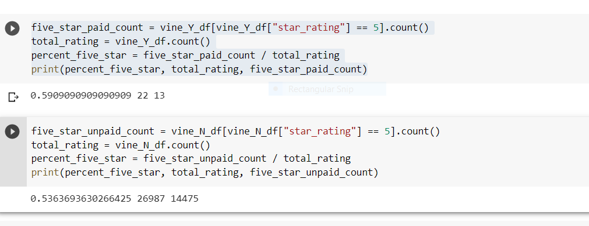

# Amazon_Vine_Program_Analysis

## Resources:
AWS, PgAdmin4, Google Colab, PySpark

## Overview of analysis:
To find out if there is any bias towards shoe reviews written by members of the Amazon Vine Program (a service that allows publishers and manufacturers to receive reviews for their products)
Questions:
* How many Vine reviews and non-Vine reviews were there?
* How many Vine reviews were 5 stars? How many non-Vine reviews were 5 stars?
* What percentage of Vine reviews were 5 stars? What percentage of non-Vine reviews were 5 stars?

* There are total of 22 Vine reviews
* There are 13 (5 star Vine reviews)
* 59% were 5 start Vine reviews

* There are total of 26987 Non_Vine reviews
* There are 14475 (5 star Non_Vine reviews)
* 54% were 5 star Non_Vine reviews

## Summary: 
The calculated results show that there isn't any bias from the members of the paid Amazon Vine Program towards the reviews.  The numbers show that there were only 22 votes from the memebers of the Vine Program and overwhelming 26987 votes from the Non_vine members for all the votes.  As for the five star reviews there were only 13 votes from the Vine Program and 14475 votes from the Non_vine program.
Another type of analysis to support these findings could be NLP Sentiment Analysis (opinion mining) which would show the positive, negative, or neutral tone of the reviews.  Five star review implies positive emotions as one star implies negetive emotion.  
